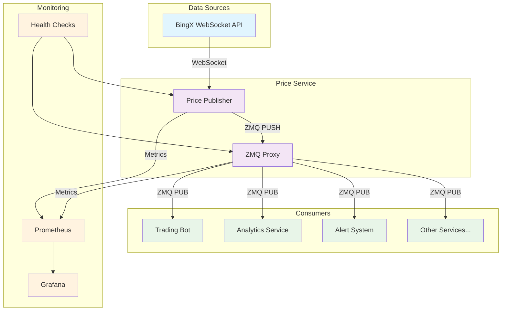

# 🚀 Enterprise Crypto Price Service

[](https://docker.com)
[](https://zeromq.org)
[](https://prometheus.io)
[](https://python.org)
[](LICENSE)

A high-performance, enterprise-grade cryptocurrency price streaming service built with ZeroMQ, featuring real-time data distribution, comprehensive monitoring, and production-ready reliability.

## 🌟 Key Features

- **🔄 Real-time Price Streaming**: Low-latency cryptocurrency price data from BingX exchange
- **⚡ High-Performance Messaging**: ZeroMQ-based message broker with configurable patterns
- **📊 Comprehensive Monitoring**: Prometheus metrics with health checks and performance tracking
- **🐳 Docker Ready**: Containerized deployment with multi-stage builds
- **🔧 Production Ready**: Enterprise-grade error handling, logging, and resource management
- **🏆 Leader Election**: Kubernetes-native leader election for high availability
- **🛡️ Fault Tolerant**: Graceful shutdown, automatic reconnection, and circuit breakers

## 🏗️ Architecture



## 🚀 Quick Start

### Prerequisites

- Docker & Docker Compose
- Python 3.11+ (for local development)
- Access to cryptocurrency exchange APIs

### 1. Clone the Repository

```bash
git clone https://github.com/yourusername/crypto-price-service.git
cd crypto-price-service
```

### 2. Configure Environment

```bash
# Copy and edit configuration
cp config/proxy_config.json.example config/proxy_config.json

# Set environment variables
export TRADING_PAIRS="BTC-USDT,ETH-USDT,DOGE-USDT"
export LOG_LEVEL=INFO
```

### 3. Start Services

```bash
# Start all services
docker-compose up -d

# View logs
docker-compose logs -f

# Check service health
curl http://localhost:8000/metrics
```

### 4. Verify Data Flow

```bash
# Subscribe to price updates
python examples/subscriber.py

# Check metrics
curl http://localhost:8000/metrics | grep zmq_proxy
```

## 📦 Services Overview

### 🔄 Price Publisher (`bingx-publisher`)

Connects to BingX WebSocket API and streams real-time price data.

**Key Features:**
- WebSocket connection management with auto-reconnection
- Data compression and efficient serialization
- Leader election for high availability
- Comprehensive error handling and retry logic
- Resource monitoring and health checks

**Environment Variables:**
```bash
EXCHANGE_NAME=bingx
ZMQ_PUSH_ENDPOINT=tcp://zmq-proxy:5546
TRADING_PAIRS=XAUT-USDT,DOGE-USDT,ETH-USDT
URL_BINGX=wss://open-api-swap.bingx.com/swap-market
LOG_DIR=/var/log/crypto
LEADER_ELECTION_ENABLED=true
```

### ⚡ ZMQ Proxy (`zmq-proxy`)

High-performance message broker distributing price data to multiple consumers.

**Key Features:**
- PULL-PUB pattern for scalable message distribution
- Configurable high water marks and message limits
- Real-time throughput and latency monitoring
- Resource usage tracking (CPU, memory)
- Health score calculation and reporting

**Exposed Ports:**
- `5545`: Frontend (PUB) - for subscribers
- `5546`: Backend (PULL) - for publishers  
- `8000`: Metrics endpoint

## 📊 Monitoring & Metrics

### Prometheus Metrics

The service exposes comprehensive metrics for monitoring:

#### Message Flow Metrics
```promql
# Message rates
rate(zmq_proxy_messages_received_total[5m])
rate(zmq_proxy_messages_forwarded_total[5m])

# Error rates
rate(zmq_proxy_message_errors_total[5m])

# Processing latency
histogram_quantile(0.95, zmq_proxy_processing_time_seconds)
```

#### System Metrics
```promql
# Resource usage
zmq_proxy_memory_usage_bytes
zmq_proxy_cpu_usage_percent

# Health score
zmq_proxy_health_score

# Queue depth
zmq_proxy_queue_size
```

### Health Checks

Services include multiple health check endpoints:

```bash
# ZMQ Proxy health
curl http://localhost:8000/health

# Docker health checks
docker ps --format "table {{.Names}}\t{{.Status}}"
```

### Grafana Dashboard

Import the provided dashboard for visualization:

```bash
# Import dashboard
curl -X POST \
  http://grafana:3000/api/dashboards/db \
  -H 'Content-Type: application/json' \
  -d @monitoring/grafana-dashboard.json
```

## 🔧 Configuration

### ZMQ Proxy Configuration

Edit `config/proxy_config.json`:

```json
{
  "frontend_port": 5545,
  "backend_pull_port": 5546,
  "monitoring_port": 8000,
  "max_workers": 1,
  "receive_timeout_ms": 1000,
  "high_water_mark": 1000,
  "log_level": "INFO",
  "linger_ms": 1000,
  "enable_compression": false,
  "max_message_size": 10485760
}
```

### Trading Pairs

Configure which cryptocurrency pairs to stream:

```bash
# Environment variable
TRADING_PAIRS=BTC-USDT,ETH-USDT,DOGE-USDT,XAUT-USDT

# Multiple exchanges support
EXCHANGE_NAME=bingx  # Currently supports: bingx
```

### Resource Limits

Adjust Docker resource limits in `docker-compose.yml`:

```yaml
deploy:
  resources:
    limits:
      memory: 512M
      cpus: '0.5'
    reservations:
      memory: 256M
      cpus: '0.25'
```

## 🏆 High Availability & Leader Election

For production deployments, enable leader election to ensure only one publisher is active:

### Kubernetes Deployment

```yaml
apiVersion: apps/v1
kind: StatefulSet
metadata:
  name: bingx-publisher
spec:
  replicas: 3
  template:
    spec:
      containers:
      - name: publisher
        env:
        - name: LEADER_ELECTION_ENABLED
          value: "true"
        - name: LEADER_ELECTION_LEASE_DURATION
          value: "5"
        - name: LEADER_ELECTION_RETRY_PERIOD
          value: "1"
```

### Leader Election Features

- **Fast Failover**: 1-5 seconds recovery time
- **Graceful Shutdown**: Immediate lease release
- **Split-Brain Prevention**: Kubernetes lease-based coordination
- **Health Monitoring**: Automatic leader re-election on health failures

### Testing Failover

```bash
# Test leader election
./scripts/test_leader_election.sh

# Monitor lease status
kubectl get lease bingx-publisher-leader -w

# Check current leader
kubectl get lease bingx-publisher-leader -o jsonpath='{.spec.holderIdentity}'
```

## 🛠️ Development

### Local Development Setup

```bash
# Create virtual environment
python -m venv venv
source venv/bin/activate  # or `venv\Scripts\activate` on Windows

# Install dependencies
pip install -r requirements.price_publisher.txt
pip install -r requirements.proxy.txt

# Run locally
python scripts/price_publisher.py
python scripts/zmq_proxy.py
```

### Adding New Exchanges

1. Create exchange connector in `scripts/exchanges/`
2. Implement WebSocket connection and message parsing
3. Add configuration to environment variables
4. Update Docker compose with new service

Example structure:
```python
class NewExchangeConnector:
    async def connect(self):
        # WebSocket connection logic
        pass
    
    async def subscribe_to_pairs(self, pairs):
        # Subscribe to trading pairs
        pass
    
    def parse_message(self, message):
        # Parse exchange-specific message format
        pass
```

### Testing

```bash
# Run unit tests
python -m pytest tests/

# Integration tests
docker-compose -f docker-compose.test.yml up

# Load testing
python tests/load_test.py --connections 100 --duration 60
```

## 📋 Production Deployment

### Docker Swarm

```bash
# Deploy to swarm
docker stack deploy -c docker-compose.prod.yml crypto-stack

# Scale services
docker service scale crypto-stack_bingx-publisher=3
```

### Kubernetes

```bash
# Apply manifests
kubectl apply -f k8s/

# Monitor deployment
kubectl get pods -l app=crypto-price-service -w

# Check logs
kubectl logs -f deployment/bingx-publisher
```

### Performance Tuning

#### ZMQ Settings
```json
{
  "high_water_mark": 10000,     // Increase for high throughput
  "receive_timeout_ms": 100,    // Decrease for lower latency
  "max_message_size": 1048576   // Adjust based on message size
}
```

#### System Settings
```bash
# Increase file descriptor limits
echo "* soft nofile 65536" >> /etc/security/limits.conf
echo "* hard nofile 65536" >> /etc/security/limits.conf

# Optimize network buffers
echo 'net.core.rmem_max = 134217728' >> /etc/sysctl.conf
echo 'net.core.wmem_max = 134217728' >> /etc/sysctl.conf
```

## 🔍 Troubleshooting

### Common Issues

#### WebSocket Connection Failures
```bash
# Check network connectivity
curl -I https://open-api-swap.bingx.com

# Verify SSL certificates
openssl s_client -connect open-api-swap.bingx.com:443

# Check logs
docker logs bingx-price-publisher
```

#### ZMQ Message Loss
```bash
# Check high water mark settings
docker exec zmq-proxy python -c "import zmq; print(zmq.HWM)"

# Monitor queue sizes
curl http://localhost:8000/metrics | grep queue_size

# Verify subscriber connections
netstat -an | grep :5545
```

#### High Memory Usage
```bash
# Check memory metrics
docker stats --no-stream

# Monitor garbage collection
docker exec bingx-publisher python -c "import gc; print(gc.get_stats())"

# Profile memory usage
docker exec bingx-publisher python -m memory_profiler scripts/price_publisher.py
```

### Debugging Tools

```bash
# Enable debug logging
export LOG_LEVEL=DEBUG

# ZMQ message tracing
export ZMQ_TRACE=1

# Network packet capture
tcpdump -i any port 5545 -w zmq_traffic.pcap
```

## 📈 Performance Benchmarks

### Throughput
- **Messages/sec**: 10,000+ (typical crypto market data)
- **Latency**: <1ms (publisher to subscriber)
- **Memory usage**: <256MB per service
- **CPU usage**: <10% (idle), <50% (peak load)

### Scaling Limits
- **Max subscribers**: 1,000+ concurrent connections
- **Max message rate**: 50,000 messages/second
- **Max message size**: 10MB (configurable)

## 🤝 Contributing

We welcome contributions! Please see our [Contributing Guide](CONTRIBUTING.md) for details.

### Development Workflow

1. Fork the repository
2. Create a feature branch: `git checkout -b feature/amazing-feature`
3. Make your changes and add tests
4. Ensure all tests pass: `make test`
5. Submit a pull request

### Code Standards

- Follow PEP 8 for Python code
- Add type hints where appropriate
- Include comprehensive docstrings
- Maintain test coverage >90%

## 📄 License

This project is licensed under the MIT License - see the [LICENSE](LICENSE) file for details.

## 🙏 Acknowledgments

- [ZeroMQ](https://zeromq.org/) for high-performance messaging
- [Prometheus](https://prometheus.io/) for monitoring capabilities
- [BingX](https://bingx.com/) for providing cryptocurrency market data
- The open-source community for inspiration and tools

## 📞 Support

- **Documentation**: [Wiki](https://github.com/yourusername/crypto-price-service/wiki)
- **Issues**: [GitHub Issues](https://github.com/yourusername/crypto-price-service/issues)
- **Discussions**: [GitHub Discussions](https://github.com/yourusername/crypto-price-service/discussions)
- **Email**: support@yourcompany.com

---

<div align="center">
  <sub>Built with ❤️ for the crypto community</sub>
</div>
